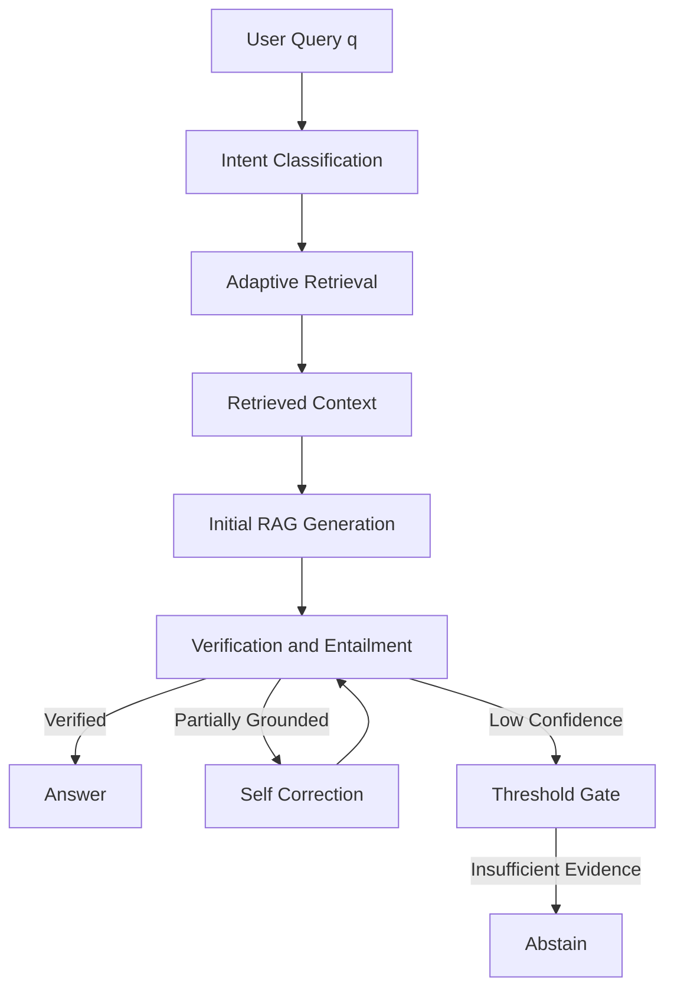

# 🧠 Self-Correcting, Intent-Aware RAG  
### *A Failure-Aware Retrieval-Augmented Generation System (Free-Tier Only)*

<p align="center">
  <b>Adaptive Retrieval • Hallucination Detection • Self-Correction • Explicit Abstention</b>
</p>

---

## 🚨 Why This Project Exists (Problem Statement)

> **Modern RAG systems hallucinate not because they lack data —  
> but because they lack epistemic awareness.**

Classic RAG pipelines assume:

\[
\text{High Similarity} \Rightarrow \text{High Truth}
\]

This assumption is **false**.

Semantic similarity does **not** guarantee:
- factual entailment
- temporal correctness
- contextual grounding

This project proposes a **verification-first RAG architecture** that treats hallucination as a *detectable failure mode*, not an accident.

---

## 🧠 Core Contributions (What Makes This “Elite”)

<div style="border-left: 4px solid #6f42c1; padding-left: 12px;">
<b>Key Insight:</b><br>
Generation should be the <i>weakest</i> component in a RAG system —  
verification and retrieval should dominate the pipeline.
</div>

This system introduces:

- **Intent-conditioned retrieval policies**
- **Formal grounding verification using NLI-style entailment**
- **Iterative, constraint-based self-correction**
- **Deterministic failure-aware abstention**

All implemented **without paid APIs or fine-tuning**.

---

## 👥 Who Is This For?

This project is designed for:

- **Students** exploring advanced Retrieval-Augmented Generation (RAG) beyond basic LangChain demos  
- **Researchers** interested in hallucination detection, self-correcting pipelines, and verification-first LLM systems  
- **Engineers** who care more about *reliability and correctness* than raw fluency  
- **Evaluators / Professors** assessing system design, architectural clarity, and reasoning depth  

If you are looking for a chatbot demo — this is not it.  
If you are interested in **building LLM systems that know when they might be wrong**, you’re in the right place.

---

## 🧩 System Overview (Formal Pipeline)



---

## ⚙️ How to Run
> **Prerequisites:** Python 3.10+, Git, and API keys for the listed free-tier LLM providers.

### 1. Clone the repository
```bash
git clone https://github.com/Raunak-23/Self_Correcting_RAG.git
cd Self_Correcting_RAG
```

### 2. Create and activate a virtual environment
```bash
python -m venv venv
source venv/bin/activate        # Linux / macOS
venv\\Scripts\\activate         # Windows
```

### 3. Install dependencies
```bash
pip install -r requirements.txt
```

### 4. Set up API keys
Create a .env file and add your API keys as per .env.example :
```bash
QDRANT_URL=your_qdrant_url_here
QDRANT_API_KEY=your_qdrant_api_key_here
OPENROUTER_API_KEY=your_openrouter_api_key_here
GOOGLE_API_KEY=your_google_api_key_here
GROQ_API_KEY=your_groq_api_key_here
```

### 5. Run the system
```bash
python main.py
```
This will execute the end-to-end pipeline:
intent classification → adaptive retrieval → generation → verification → correction / abstention.

---

## 🧩 System Overview (Formal Pipeline)

Let:
q       = user query
I(q)    = inferred intent
R_I(q)  = intent-specific retrieval policy
C_k     = retrieved context (top-k chunks)
G(.)    = generation function
V(.)    = verification function
 
The system executes:

```text
q → I(q) → R_{I(q)} → C_k → G(q, C_k) → V(claims, C_k)
        ↳ Answer (if verified)
        ↳ Correct (if salvageable)
        ↳ Abstain (if unreliable)
```

---

## 1️⃣ Intent Classification — *High-Dimensional Query Router*

I(q) = argmax_c P(c | q),  where c ∈ C

**Why LLM-based classification?**  
It offers semantic generalization, structured outputs, and zero training cost.

**Model:** Llama 3.1 8B (Groq)

---

## 2️⃣ Adaptive Retrieval — *Dynamic k-NN Controller*

k = f(I(q))   // number of retrieved chunks depends on intent

| Intent | Chunk Size | k | Strategy |
|------|-----------|---|----------|
| Factual | 256 | 5 | Precision-first |
| Comparative | 512 | 10 | Multi-query |
| Conceptual | 1024+ | 15 | Context-heavy |
| Ambiguous | variable | adaptive | HyDE |

### HyDE

â = G(q, ∅)   // hypothetical answer generated without context

---

## 3️⃣ Initial RAG Generation

> Generation may be wrong — verification may not.

**Model:** Gemini 3 Flash

---

## 4️⃣ Verification Judge — *NLI Entailment Engine*

A → { c1, c2, ..., cn }   // atomic claim decomposition

Each claim checked via entailment:

E(ci, Ck) ∈ {entailed, neutral, contradicted}


**Model:** Nemotron-3 Nano 30B

---

## 5️⃣ Self-Correction — *Constraint-Based Refinement*

A_{t+1} = argmin_Δ || Δ(A_t) ||

Preserves verified claims while removing hallucinations.

**Model:** Llama 4 Maverick

---

## 6️⃣ Failure-Aware Abstention — *Threshold Gate*

Hard Abstention if:

max cosine_similarity < τ   (τ ≈ 0.65)


Soft Abstention if <50% of claims are entailed.

<div style="border-left: 4px solid #d73a49; padding-left: 12px;">
<b>Abstention is a designed outcome, not a fallback.</b>
</div>

---

## 📊 Evaluation

Evaluated using **RAGAS**:
- Faithfulness
- Context Precision
- Context Recall
- Answer Relevance

---

## 🧭 Design Philosophy

- Similarity ≠ Truth  
- Retrieval > Generation  
- Verification > Fluency  
- Honesty > Confidence  

---

## 🧠 Final Remark

Traditional RAG systems are fluent.  
This one is careful.

That difference matters.
